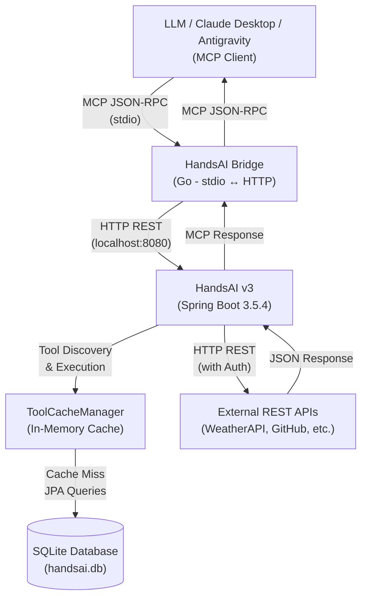
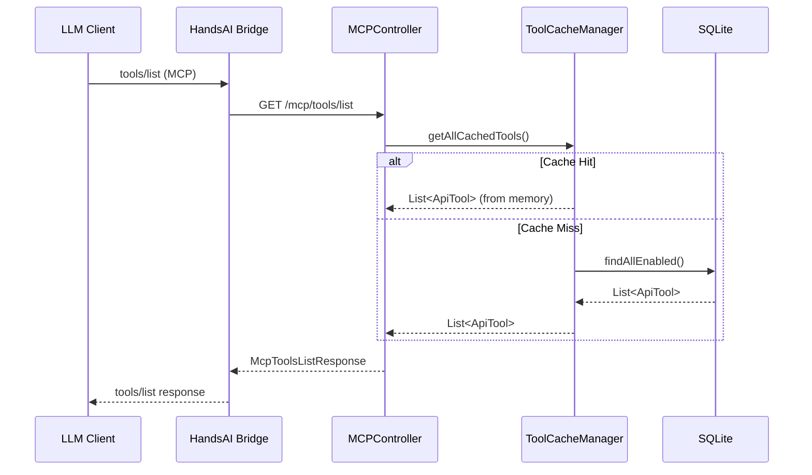
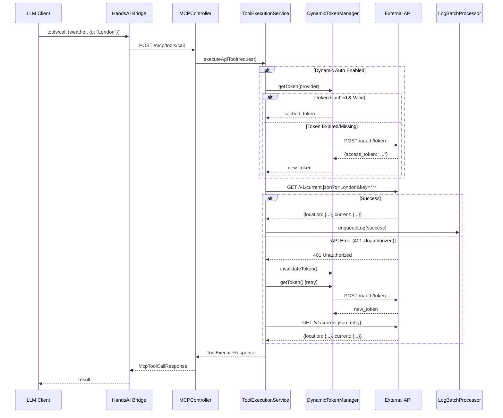

# Architecture Overview

HandsAI is built as a high-performance bridge service that connects Model Context Protocol (MCP) clients to arbitrary REST APIs through a dynamic tool registry.

## System Architecture Diagram



## Core Components

### 1. HandsAI Bridge (Go)

**Purpose**: Protocol translation layer between MCP's stdio-based JSON-RPC and HandsAI's HTTP REST API.

**Key Responsibilities**:
- Accept MCP `tools/list` requests and forward to `/mcp/tools/list`
- Accept MCP `tools/call` requests and forward to `/mcp/tools/call`
- Translate responses back to MCP format over stdio
- Handle connection lifecycle and error propagation

**Source**: [github.com/Vrivaans/handsai-bridge](https://github.com/Vrivaans/handsai-bridge)

<Tip>
  The bridge is stateless and can be restarted without affecting HandsAI's state. Configuration is optional via `config.json` for custom base URLs.
</Tip>

### 2. Spring Boot API (Java 21)

**Tech Stack**:
- **Framework**: Spring Boot 3.5.4 (Spring MVC)
- **Java Version**: Java 21 LTS
- **Concurrency**: Virtual Threads via `Executors.newVirtualThreadPerTaskExecutor()`
- **Build Tool**: Maven 3.8+
- **Native Compilation**: GraalVM Native Image support

**Main Controllers**:

<AccordionGroup>
  <Accordion title="MCPController (/mcp)" icon="plug">
    Implements the Model Context Protocol for tool discovery and execution.
    
    **Endpoints**:
    - `GET /mcp/tools/list` - Returns all enabled, healthy tools in MCP format
    - `POST /mcp/tools/call` - Executes a tool by name with JSON-RPC 2.0 protocol
    
    **Location**: `org.dynamcorp.handsaiv2.controller.MCPController`
    
    **Error Handling**:
    - `-32602`: Invalid params (missing required fields)
    - `-32603`: Internal error (execution failure)
    
    All responses follow JSON-RPC 2.0 specification.
  </Accordion>
  
  <Accordion title="AdminToolController (/admin/tools/api)" icon="screwdriver-wrench">
    CRUD operations for individual tools (used by the frontend UI).
    
    **Endpoints**:
    - `GET /admin/tools/api` - List all tools
    - `GET /admin/tools/api/{id}` - Get tool by ID
    - `POST /admin/tools/api` - Create new tool
    - `PUT /admin/tools/api/{id}` - Update tool
    - `DELETE /admin/tools/api/{id}` - Delete tool
    
    **Location**: `org.dynamcorp.handsaiv2.controller.AdminToolController`
  </Accordion>
  
  <Accordion title="ImportController (/api/import)" icon="file-import">
    Batch import providers and tools from JSON.
    
    **Endpoint**: `POST /api/import/providers`
    
    **Behavior**:
    - Upsert by `code` field (creates if new, updates if exists)
    - Preserves existing API keys if import value is `<YOUR_API_KEY>` placeholder
    - Creates tools and parameters in a single transaction
    
    **Location**: `org.dynamcorp.handsaiv2.controller.ImportController`
  </Accordion>
  
  <Accordion title="ExportController (/api/export)" icon="file-export">
    Export providers and tools to JSON format.
    
    **Endpoint**: `GET /api/export/providers?ids=1,2,3`
    
    **Security**: Automatically obfuscates API keys to `<YOUR_API_KEY>` in export.
    
    **Location**: `org.dynamcorp.handsaiv2.controller.ExportController`
  </Accordion>
</AccordionGroup>

### 3. SQLite Database

**Configuration**:
- **File**: `handsai.db` (auto-created in project root)
- **Mode**: WAL (Write-Ahead Logging) for high concurrency
- **Dialect**: `org.hibernate.community.dialect.SQLiteDialect`
- **Connection Pool**: HikariCP with virtual threads

**Core Tables**:

<CodeGroup>
```sql api_provider
CREATE TABLE api_provider (
  id INTEGER PRIMARY KEY AUTOINCREMENT,
  name TEXT NOT NULL,
  code TEXT UNIQUE NOT NULL,
  base_url TEXT NOT NULL,
  authentication_type TEXT, -- API_KEY, BEARER_TOKEN, BASIC_AUTH
  api_key_location TEXT,    -- HEADER, QUERY_PARAMETER, IN_BODY
  api_key_name TEXT,
  api_key_value TEXT,       -- Encrypted via Jasypt
  is_dynamic_auth BOOLEAN DEFAULT FALSE,
  dynamic_auth_url TEXT,
  dynamic_auth_method TEXT, -- GET, POST
  dynamic_auth_payload TEXT,
  dynamic_auth_token_extraction_path TEXT,
  custom_headers_json TEXT,
  created_at TIMESTAMP DEFAULT CURRENT_TIMESTAMP,
  updated_at TIMESTAMP DEFAULT CURRENT_TIMESTAMP
);
```

```sql api_tool
CREATE TABLE api_tool (
  id INTEGER PRIMARY KEY AUTOINCREMENT,
  provider_id INTEGER NOT NULL,
  name TEXT NOT NULL,
  code TEXT UNIQUE NOT NULL,
  description TEXT,
  endpoint_path TEXT NOT NULL,
  http_method TEXT NOT NULL,  -- GET, POST, PUT, DELETE, PATCH
  enabled BOOLEAN DEFAULT TRUE,
  is_healthy BOOLEAN DEFAULT TRUE,
  is_exportable BOOLEAN DEFAULT TRUE,
  body_payload_template TEXT,
  created_at TIMESTAMP DEFAULT CURRENT_TIMESTAMP,
  FOREIGN KEY (provider_id) REFERENCES api_provider(id)
);
```

```sql tool_parameter
CREATE TABLE tool_parameter (
  id INTEGER PRIMARY KEY AUTOINCREMENT,
  api_tool_id INTEGER NOT NULL,
  name TEXT NOT NULL,
  type TEXT NOT NULL,         -- STRING, NUMBER, BOOLEAN, ARRAY
  description TEXT,
  required BOOLEAN DEFAULT FALSE,
  default_value TEXT,
  FOREIGN KEY (api_tool_id) REFERENCES api_tool(id)
);
```
</CodeGroup>

<Note>
  API keys are encrypted at rest using Jasypt with AES-256. The encryption key is generated on first run and stored in environment variables.
</Note>

### 4. ToolCacheManager

**Purpose**: In-memory cache for tool definitions to eliminate database queries on every MCP discovery request.

**Implementation**: `org.dynamcorp.handsaiv2.service.ToolCacheManager`

**Data Structure**:
```java
private final ConcurrentHashMap<String, ApiTool> toolCache;
```

**Lifecycle**:

<Steps>
  <Step title="Initialization (@PostConstruct)">
    On application startup, loads all enabled tools from database:
    
    ```java
    @PostConstruct
    public void initCache() {
        List<ApiTool> activeTools = apiToolRepository.findAllEnabled();
        activeTools.forEach(tool -> toolCache.put(tool.getCode(), tool));
        log.info("Tool cache initialized with {} tools", activeTools.size());
    }
    ```
  </Step>
  
  <Step title="Cache Lookup">
    Tools are retrieved by code (O(1) lookup):
    
    ```java
    public Optional<ApiTool> getCachedTool(String toolCode) {
        return Optional.ofNullable(toolCache.get(toolCode))
            .filter(tool -> tool.isEnabled() && tool.isHealthy());
    }
    ```
  </Step>
  
  <Step title="Cache Invalidation">
    Updated when tools are created, modified, or deleted via admin API.
    
    Manual refresh available via native tool:
    ```bash
    # Refresh cache without restart
    curl -X POST http://localhost:8080/mcp/tools/call \
      -d '{"params":{"name":"handsai_refresh_tool_cache"}}'
    ```
  </Step>
</Steps>

**Performance Impact**:
- **Without Cache**: 50-100ms per discovery (database query + JSON serialization)
- **With Cache**: < 5ms per discovery (memory lookup only)

## Data Flow

### Tool Discovery Flow



### Tool Execution Flow



<Tip>
  The automatic retry on 401 errors is a key feature of `DynamicTokenManager`. It detects expired tokens and refreshes them transparently without failing the LLM request.
</Tip>

## Authentication Strategies

HandsAI supports multiple authentication methods:

<Tabs>
  <Tab title="API Key">
    **Locations**:
    - `HEADER`: `X-API-Key: your_key` or custom header name
    - `QUERY_PARAMETER`: `?key=your_key` appended to URL
    - `IN_BODY`: `{"api_key": "your_key"}` in JSON body
    
    **Example** (WeatherAPI):
    ```json
    {
      "authenticationType": "API_KEY",
      "apiKeyLocation": "QUERY_PARAMETER",
      "apiKeyName": "key",
      "apiKeyValue": "abc123..."  // Encrypted in DB
    }
    ```
  </Tab>
  
  <Tab title="Bearer Token">
    Adds `Authorization: Bearer <token>` header.
    
    **Example** (GitHub):
    ```json
    {
      "authenticationType": "BEARER_TOKEN",
      "apiKeyLocation": "HEADER",
      "apiKeyName": "Authorization",
      "apiKeyValue": "ghp_..."  // Encrypted in DB
    }
    ```
  </Tab>
  
  <Tab title="Dynamic Auth (OAuth2)">
    Fetches access tokens automatically before each request.
    
    **Flow**:
    1. Check token cache (5-minute TTL)
    2. If expired, POST to `dynamicAuthUrl` with credentials
    3. Extract token using JSONPath (`dynamicAuthTokenExtractionPath`)
    4. Cache token and use in subsequent requests
    5. Auto-retry on 401 with fresh token
    
    **Example** (Bluesky):
    ```json
    {
      "isDynamicAuth": true,
      "dynamicAuthUrl": "https://bsky.social/xrpc/com.atproto.server.createSession",
      "dynamicAuthMethod": "POST",
      "dynamicAuthPayloadType": "JSON",
      "dynamicAuthPayload": "{\"identifier\":\"user.bsky.social\",\"password\":\"...\"}",
      "dynamicAuthTokenExtractionPath": "accessJwt",
      "dynamicAuthInvalidationKeywords": "ExpiredToken,AuthenticationRequired"
    }
    ```
    
    **Source**: `org.dynamcorp.handsaiv2.service.DynamicTokenManager`
  </Tab>
  
  <Tab title="Basic Auth">
    Adds `Authorization: Basic <base64(user:pass)>` header.
    
    **Example**:
    ```json
    {
      "authenticationType": "BASIC_AUTH",
      "apiKeyValue": "user:password"  // Base64 encoded automatically
    }
    ```
  </Tab>
</Tabs>

## Advanced Features

### 1. Body Payload Templates

For APIs requiring nested JSON structures, use `bodyPayloadTemplate` with parameter interpolation.

**Example** (Jules API):

```json
{
  "bodyPayloadTemplate": "{\"prompt\": \"{{prompt}}\", \"sourceContext\": {\"source\": \"{{source}}\", \"githubRepoContext\": {\"startingBranch\": \"{{startingBranch}}\"}}}",
  "parameters": [
    {"name": "prompt", "type": "STRING", "required": true},
    {"name": "source", "type": "STRING", "required": true},
    {"name": "startingBranch", "type": "STRING", "required": false}
  ]
}
```

**Execution**:
LLM provides: `{"prompt": "Fix bug", "source": "sources/github/...", "startingBranch": "main"}`

HandsAI interpolates to:
```json
{
  "prompt": "Fix bug",
  "sourceContext": {
    "source": "sources/github/...",
    "githubRepoContext": {
      "startingBranch": "main"
    }
  }
}
```

### 2. Array Parameter Handling

LLMs can send arrays as native JSON or string-encoded JSON. HandsAI automatically deserializes both.

**Definition**:
```json
{
  "name": "platforms",
  "type": "ARRAY",
  "description": "Social media platforms (e.g., ['linkedin', 'twitter'])"
}
```

**LLM Sends** (Option 1 - Native):
```json
{"platforms": ["linkedin", "twitter"]}
```

**LLM Sends** (Option 2 - String):
```json
{"platforms": "[\"linkedin\", \"twitter\"]"}
```

**HandsAI Deserializes To**:
```json
{"platforms": ["linkedin", "twitter"]}
```

**Source**: `ToolExecutionService.resolveArrayParams()` at line 385

### 3. Path Parameter Substitution

Dynamic URL building for RESTful endpoints.

**Definition**:
```json
{
  "endpointPath": "/repos/{owner}/{repo}/issues"
}
```

**LLM Provides**:
```json
{"owner": "facebook", "repo": "react", "title": "Bug report"}
```

**Final URL**:
```
https://api.github.com/repos/facebook/react/issues
```

**Body** (remaining params):
```json
{"title": "Bug report"}
```

### 4. Logging & Analytics

**Batch Processing**: Execution logs are queued in-memory and persisted in batches to reduce SQLite write contention.

**Logged Data**:
- Tool name and session ID
- Request payload (obfuscated)
- Response payload (obfuscated)
- Execution time (ms)
- Success/failure status
- Error messages

**Source**: `org.dynamcorp.handsaiv2.service.LogBatchProcessor`

**Obfuscation**: API keys and sensitive headers are redacted in logs via `LogObfuscator`.

## Virtual Threads (Java 21)

HandsAI uses Virtual Threads for all async operations, providing:

- **High Concurrency**: Handle thousands of tool executions simultaneously
- **Low Overhead**: Virtual threads are lightweight (< 1KB stack)
- **Simplified Code**: No need for reactive programming or callbacks

**Configuration**:
```java
@Configuration
public class VirtualThreadConfig {
    @Bean
    @Primary
    public Executor taskExecutor() {
        return Executors.newVirtualThreadPerTaskExecutor();
    }
}
```

**Location**: `org.dynamcorp.handsaiv2.config.VirtualThreadConfig`

## GraalVM Native Image

**Compilation**:
```bash
./mvnw -Pnative native:compile
```

**Benefits**:
- **Startup**: < 1.5 seconds (vs. 3-5s on JVM)
- **Memory**: ~100MB RSS (vs. 300-500MB on JVM)
- **Ideal For**: Local AI agents, serverless, edge deployments

**Compatibility Requirements**:

All reflection, dynamic proxies, and resource loading must be registered in `NativeHintsConfig`.

**Example** (Registering Jasypt for encryption):
```java
@Configuration
public class NativeHintsConfig implements RuntimeHintsRegistrar {
    @Override
    public void registerHints(RuntimeHints hints, ClassLoader classLoader) {
        hints.reflection().registerType(
            TypeReference.of("org.jasypt.encryption.pbe.StandardPBEStringEncryptor"),
            MemberCategory.INVOKE_DECLARED_CONSTRUCTORS,
            MemberCategory.INVOKE_DECLARED_METHODS
        );
    }
}
```

**Location**: `org.dynamcorp.handsaiv2.config.NativeHintsConfig`

<Warning>
  Always test native builds after adding dependencies that use reflection (e.g., Jackson mixins, dynamic class loading).
</Warning>

## Scalability & Performance

<CardGroup cols={2}>
  <Card title="Tool Discovery" icon="gauge-high">
    **Cached**: < 5ms
    
    **Uncached**: 50-100ms
    
    (Typical: 100% cache hit rate)
  </Card>
  
  <Card title="Tool Execution" icon="bolt">
    **Local**: 10-50ms
    
    **Remote API**: 100-500ms
    
    (Depends on external API latency)
  </Card>
  
  <Card title="Concurrency" icon="server">
    **Virtual Threads**: 10,000+ concurrent requests
    
    **SQLite WAL**: Handles high read/write concurrency
  </Card>
  
  <Card title="Memory" icon="memory">
    **JVM Mode**: 300-500MB
    
    **Native Mode**: ~100MB
    
    (Scales with cache size)
  </Card>
</CardGroup>

## Security Considerations

<AccordionGroup>
  <Accordion title="API Key Encryption" icon="lock">
    - All API keys encrypted at rest using Jasypt (AES-256)
    - Encryption key stored in environment variables
    - Keys decrypted in-memory only during execution
    - Logs automatically obfuscate sensitive values
  </Accordion>
  
  <Accordion title="Request Validation" icon="shield-check">
    - Input validated against tool parameter schemas
    - Required parameters enforced
    - Type checking for STRING, NUMBER, BOOLEAN, ARRAY
    - Malformed JSON rejected with 400 errors
  </Accordion>
  
  <Accordion title="Rate Limiting" icon="gauge">
    - Not implemented in HandsAI (delegated to external APIs)
    - Logging tracks execution frequency per tool
    - Consider adding Spring rate limiting for production
  </Accordion>
  
  <Accordion title="CORS Configuration" icon="globe">
    - Default: `@CrossOrigin(origins = "*")` for development
    - Production: Configure specific origins in `application.properties`
  </Accordion>
</AccordionGroup>

## Next Steps

<CardGroup cols={2}>
  <Card title="API Reference" icon="book" href="/api/mcp/overview">
    Complete endpoint documentation with request/response examples
  </Card>
  
  <Card title="Quickstart" icon="rocket" href="/quickstart">
    Get HandsAI running with your first tool in 5 minutes
  </Card>
  
  <Card title="Use Cases" icon="lightbulb">
    Explore pre-built integrations:
    - Weather API
    - Email (Resend)
    - Social Media (Ayrshare)
    - GitHub automation
    - Jules Agent API
  </Card>
  
  <Card title="Contributing" icon="code-pull-request">
    Read `AGENTS.md` for architecture rules and GraalVM compatibility guidelines
  </Card>
</CardGroup>
